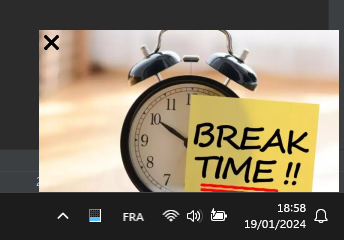
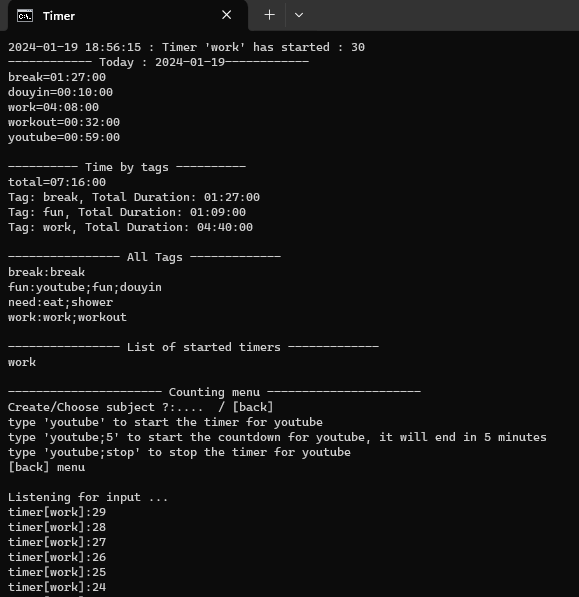
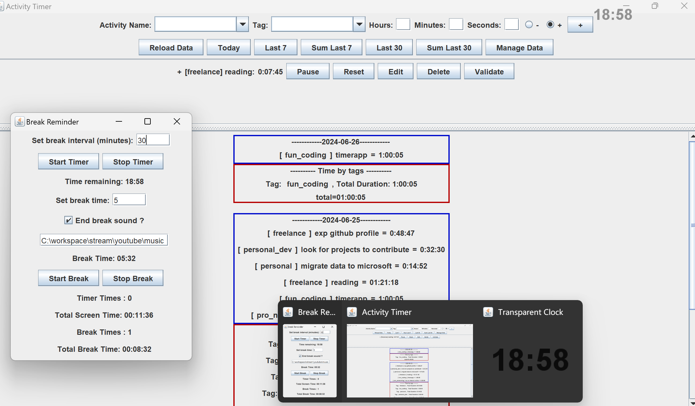

# Timer Application

Tired of productivity-sapping distractions when managing your time? Look no further! The Timer Application is your ultimate time management companion, designed to help you stay focused and distraction-free.

**Say goodbye to distractions and regain control of your time**, all within a simple and efficient time-tracking tool. Whether you're a student aiming for better study habits, a professional looking to boost work efficiency, or someone who values uninterrupted focus, our Timer Application has you covered.

## Why Choose the Timer Application?

- **Distraction-Free Tracking**: Our streamlined interface ensures that you can concentrate on what truly matters—your tasks and time management. No clutter, no distractions, just efficient time tracking.

- **Easy Time Management**: With just a few simple commands, you can start tracking your time for any activity. Monitor where your hours go without any unnecessary interruptions.

- **Tagging and Categorization**: Easily categorize your activities with tags. Want to see how much time you've spent on work, fun, or other categories? Our tagging system helps you gain insights into your time allocation.

- **Summarize and Analyze**: Get a clear picture of your time management with the ability to summarize and analyze your time data over different time periods. Understand your productivity patterns and make informed decisions.

- **User-Friendly Interface**: We've designed the Timer Application with a user-friendly command-line interface, making it accessible to everyone, from tech enthusiasts to casual users.

- **Data Persistence**: Your time data is saved securely in JSON files, ensuring that your progress is never lost.

Ready to experience distraction-free time management? Install the Timer Application and start taking back control of your day!

## Getting Started

Getting started is a breeze! Follow the simple installation steps in the [Getting Started](#getting-started) section below, and you'll be tracking your time in no time.

Don't let distractions stand in your way. Enjoy distraction-free productivity. Welcome to the Timer Application!

[](screenshot.png)

A popup will appear, reminding you to take break, after you have set a countdown for any tasks you are on !

## Table of Contents

- [Features](#features)
- [Getting Started](#getting-started)
  - [Prerequisites](#prerequisites)
  - [Installation](#installation)
- [Usage](#usage)
- [Documentation](#documentation)
- [Contributing](#contributing)
- [License](#license)

## Features

- **Tag Management**: Easily organize your activities with tags, making it simple to categorize and review your tracked time.

- **Date-Driven Tracking**: The Timer Application allows you to log your activities by date, providing a clear history of how you've spent your time over time.

- **Flexible Time Input**: Input time using the standard "hh:mm:ss" format, making it convenient to add durations for your activities.

- **Data Persistence**: Your time-tracking data is saved to JSON files, ensuring that your progress is always accessible.

## Getting Started

### Prerequisites

Before you begin, make sure you have the following:

- Java Development Kit (JDK) installed on your system.
- A terminal or command prompt.

### Installation

1. Clone or download this repository to your local machine.

```bash
git clone https://github.com/hejoseph/timetracker.git
cd Timer-Application
javac *.java
java Timer
```

Now you're ready to start using the Timer Application! Follow the on-screen instructions and command prompts to begin tracking your time.


## Usage

### Main Menu

When you run the Timer Application, you'll be greeted with a user-friendly menu that offers various options:

- count: Start tracking time for an activity.
- add: Add minutes to a specific subject.
- addTags: Create or manage tags for your activities.
- del: Delete a subject from your tracked activities.
- p7: Print the activities for the last 7 days.
- ps7: Print the summary of activities for the last 7 days.
- p: Print the activities for a specific number of days.
- ps: Print the summary of activities for a specific number of days.
- stop: Exit the Timer Application.

### Time Tracking

- To start tracking time for a specific activity, enter count. You can specify the activity and its duration (in minutes) in the format activity;minutes.
- To add minutes to a subject, use the add option and provide the subject and the duration in the format subject;hh:mm:ss.
- You can create or manage tags for your activities using the addTags option, allowing you to categorize your time.

[](screenshot2.png)


----------------- COMING SOON : NEXT RELEASE -----------
[](coming_soon.png)